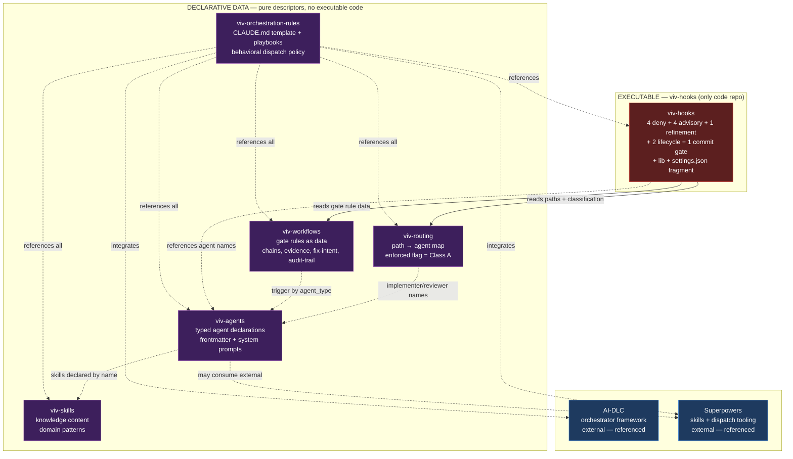
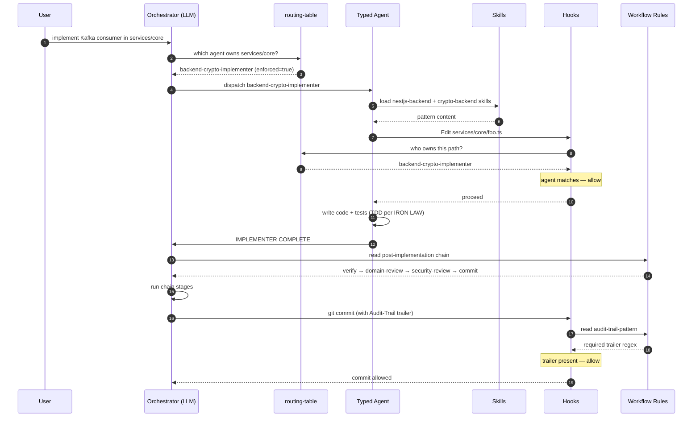

# viv-typed-agents

**The typed-agents strategy product.** A SOLID-designed enforcement and dispatch system for Claude Code that turns generic LLM dispatch into domain-specialized typed agents with structural code-quality gates.

This is **the installable** — vendor this repo into your project and run the installer. The 6 internal components (`viv-skills`, `viv-agents`, `viv-routing`, `viv-workflows`, `viv-hooks`, `viv-orchestration-rules`) are exposed publicly for transparency and surgical use, but the recommended adoption path is via this repo's installer (per [ADR-RD-010](architecture/decisions/ADR-RD-010-product-composition.md)).

---

## The concept

**Generic LLM dispatch produces low-quality code** because the LLM lacks domain-specific patterns at the moment of generation. Same problem at audit time: generic reviewers miss domain-specific issues. Typed agents solve this with four ideas working together:

### 1. Specialized dispatch (typed, not generic)

A **typed agent** is a specialized expert role. Instead of dispatching `general-purpose` for everything, the orchestrator dispatches `backend-crypto-implementer` for blockchain backend code, `frontend-implementer` for React components, `infra-devops-implementer` for Dockerfiles, etc. Each typed agent's system prompt embeds:

- **IRON LAW** — non-negotiable behavioral rules (e.g. "TDD is mandatory", "no production code without root cause for bugs")
- **Critical Constraints** — domain-specific gotchas (e.g. "BigInt for monetary values", "outbox pattern for distributed events")
- **Required skills** — auto-loaded knowledge (the agent reads pattern docs on dispatch)

### 2. Knowledge separated from identity

The same `crypto-backend` skill (knowledge about reorgs, RPC resilience, idempotency) is consumed by **both** the implementer (when writing code) and the reviewer (when auditing it). One source of truth for domain expertise. Skills are pure markdown; agents are pure descriptors that reference skills by name.

### 3. Path-based dispatch (deterministic, not heuristic)

A **routing-table** maps file paths to agent assignments:

```json
{ "domain": "backend", "paths": ["services/core/**", "services/bot/**"],
  "enforced": true,
  "implementer": "backend-crypto-implementer",
  "reviewer": "backend-crypto-reviewer" }
```

When the orchestrator (or a hook) needs to know "who handles this file?", it does a path lookup — no keyword grep, no heuristic. The same routing-table answers "is this Class A?" via the `enforced` field (single source of truth, no separate classifier).

### 4. Structural enforcement (hard gates, not just discipline)

Hooks at Claude Code's PreToolUse/PostToolUse phases:

- **Block** the main session from editing Class A paths (force dispatch through typed agents)
- **Block** subagents from escaping their scope (marker registry tracks active dispatches)
- **Block** secrets from being read or modified by any role
- **Block** commits without an audit-trail trailer
- **Block** issue closures without four required evidence markers
- **Advise** when a fix-shaped prompt lacks `Root cause:` (debugging discipline)
- **Advise** when an implementer completes (the post-implementation chain runs verification → review → security → commit)

Behavioral compliance is the first line. Hooks are the safety net — wrong dispatches don't get through.

---

## Architecture (component composition)

The product is composed of 6 internal components, each with a single reason to change. The dependency direction goes **upward**: hooks (low-level enforcement) depend on contracts published by data components (high-level abstractions).



### Component roles

| Component | Reason to change | Output (contract) | Inputs (consumed) |
|---|---|---|---|
| **viv-skills** | Domain knowledge evolves | Skill name, pattern files | None |
| **viv-agents** | Role definition or scope changes | Frontmatter (`name`, `type`, `domain`, `skills`, `tools`, `behavior`) + body system prompt | viv-skills (by name) |
| **viv-routing** | Project structure or domain registry changes | `routing-table.json` (paths, agent assignments, `enforced` flag) | viv-agents (`type`, `domain`) |
| **viv-workflows** | Gate rules or chain composition changes | 5 rule files (post-impl chain, evidence, fix-intent, pairings, audit-trail) | viv-agents (`type`) |
| **viv-orchestration-rules** | Behavioral dispatch policy evolves | CLAUDE.md template + 5 playbooks | All other repos by reference |
| **viv-hooks** | Enforcement mechanism evolves | 12 hook scripts + lib + settings fragment | viv-routing, viv-workflows (read-only) |

### Runtime dispatch flow

When a user asks the orchestrator to implement something in a Class A path:



### Why this architecture

- **SRP at the repo level** — each repo has one reason to change (skills change with knowledge; routing changes with project structure; hooks change with enforcement mechanism)
- **DIP at the composition level** — hooks (low-level) depend on contracts (high-level), not the other way around
- **OCP at the consumption level** — adding a new domain doesn't modify existing components; you add a new agent, a new routing entry, optionally a new skill
- **Pure descriptors + single code repo** — 5 of 6 components are pure data; only viv-hooks ships executable code, kept in one place where bash discipline applies
- **Validation deferred to deterministic point** — wrong dispatch is caught at Edit/Write time (when the file path is concrete), not at Agent dispatch time (when paths are inferred from prompts)

See [`SPEC.md`](SPEC.md) for the full strategy and [`architecture/solid-audit.md`](architecture/solid-audit.md) for the SOLID critique that drove these decisions.

---

## Install

```bash
git clone https://github.com/viblocks/viv-typed-agents
cd viv-typed-agents
./scripts/install.sh /path/to/your-project --tier 5
```

Or one-liner (without local clone):

```bash
curl -sL https://raw.githubusercontent.com/viblocks/viv-typed-agents/main/scripts/install.sh \
  | bash -s -- /path/to/your-project --tier 5
```

### Tier selection

| Tier | What you get | Best for |
|---|---|---|
| 1 | Skills (knowledge content) | Solo dev, occasional Claude Code use |
| 2 | + Agents (typed dispatch behaviorally) | Small team, single-domain projects |
| 3 | + Routing + Workflows (declarative orchestration) | Multi-domain projects |
| 4 | + Hooks (structural hard-deny enforcement) | Production with quality/security needs |
| 5 | + Orchestration rules (full system, autonomous flow) | Mature projects with full automation |

```bash
# Tier 1 — just skills
./scripts/install.sh ~/my-project --tier 1

# Tier 5 — full system (default)
./scripts/install.sh ~/my-project --tier 5
```

### Granular component or skill selection

```bash
# Just one skill
./scripts/install.sh ~/my-project --skills crypto-backend

# Multiple skills + specific agents
./scripts/install.sh ~/my-project \
  --skills crypto-backend,nestjs-backend \
  --agents backend-crypto-implementer,backend-crypto-reviewer

# Tier 4 without orchestration-rules
./scripts/install.sh ~/my-project --tier 4 --exclude viv-orchestration-rules
```

See `scripts/install.sh --help` for full flag reference.

## After install — run the setup wizard

For tier 3+ installs, run inside the consumer project:

```
claude
> /typedAgentSetup
```

The wizard scans the project (or asks for paths if greenfield), asks
which business domain you work in (Crypto, WaaS, Generic), and writes
the routing-table, merges hook settings, and adapts CLAUDE.md.

See `architecture/specs/2026-05-09-typed-agent-setup.md` for the full
behavior.

## Uninstall

To remove a viv-typed-agents installation from a consumer project:

```bash
./scripts/uninstall.sh /path/to/your-project
```

Defaults: removes all components, reverses the wizard's modifications to `settings.json` and `CLAUDE.md`, cleans up transient state, and removes `.claude/.install-manifest.json`. User customizations under shared namespaces (e.g., `.claude/skills/my-team-skill/`) are preserved.

### Options

| Flag | Behavior |
|---|---|
| `--components <list>` | CSV of components to remove. Default: all. Partial uninstall does NOT touch `settings.json` or `CLAUDE.md`. |
| `--dry-run` | Print the plan without removing anything. |
| `--keep-config` | On full uninstall, skip `settings.json` reverse-merge and `CLAUDE.md` unmark. |

### Examples

```bash
# Preview what would happen
./scripts/uninstall.sh ~/my-project --dry-run

# Downgrade: keep tier 3 (skills + agents + routing + workflows + orchestration),
# remove only the hooks layer
./scripts/uninstall.sh ~/my-project --components viv-hooks

# Full uninstall but keep your manually-edited settings.json + CLAUDE.md
./scripts/uninstall.sh ~/my-project --keep-config
```

The uninstaller reads `<target>/.claude/.install-manifest.json` (written by `install.sh`) to know exactly which paths it deployed. If the manifest is missing (e.g., the install pre-dates manifest support), the uninstaller aborts and points you to manual cleanup. See `architecture/specs/2026-05-11-uninstall.md` for the full design.

## What you get post-install

```
your-project/
└── .claude/
    ├── skills/                      ← knowledge patterns (T1+)
    ├── agents/                      ← typed agent declarations (T2+)
    ├── routing/                     ← path-to-agent map (T3+)
    ├── workflows/                   ← gate rule data (T3+)
    ├── hooks/                       ← structural enforcement (T4+)
    │   ├── deny/ advisory/ refinement/ lifecycle/ commit/
    │   ├── lib/
    │   └── settings.json.fragment
    └── orchestration/               ← CLAUDE.md template + playbooks (T5)
```

Next steps after install are printed by the installer (configure routing-table.json, glue settings.json, adapt CLAUDE.md).

## Upgrade

```bash
# Bump a single component to its latest main HEAD
./scripts/upgrade.sh viv-skills

# Bump to a specific SHA or branch
./scripts/upgrade.sh viv-hooks --to 99c56f8
```

### Keeping components current

Component repos advance independently. To check for drift between `MANIFEST.yaml`
and each component's upstream `main`:

    ./scripts/upgrade.sh --check

To bump every drifted component to its `main` HEAD in one shot:

    ./scripts/upgrade.sh --all
    git diff MANIFEST.yaml
    # commit with the suggested message printed by the script

To bump a single component to a specific ref (e.g. a release tag), use the
existing single-component form:

    ./scripts/upgrade.sh viv-hooks --to v1.2.0

In CI, fail the build when the manifest is stale:

    ./scripts/upgrade.sh --check --exit-code

## What's inside

This repo is the umbrella + the installer. The actual content lives in 6 internal component repos pinned in `MANIFEST.yaml`.

```
viv-typed-agents/
├── README.md                                    ← you are here
├── SPEC.md                                      ← strategy specification
├── MANIFEST.yaml                                ← pinned component SHAs
├── scripts/
│   ├── install.sh                               ← deploy product to a consumer project
│   └── upgrade.sh                               ← bump component SHAs
├── architecture/
│   ├── solid-audit.md                           ← SOLID critique of viblocks original
│   └── decisions/                               ← 10 cross-component ADRs (RD-001..RD-010)
├── composition/
│   └── tiers.md                                 ← 5 adoption tiers detailed
└── migration/
    └── from-viblocks.md                         ← migration history
```

## Internal component architecture (SOLID decomposition)

The product is composed of 6 internal repos, each with a single reason to change:

| Component | Internal repo | Role | Tiers |
|---|---|---|---|
| Knowledge | [viv-skills](https://github.com/viblocks/viv-skills) | Domain patterns + anti-patterns | 1+ |
| Roles | [viv-agents](https://github.com/viblocks/viv-agents) | Typed agent declarations | 2+ |
| Routing | [viv-routing](https://github.com/viblocks/viv-routing) | Path → agent + Class A/B classification | 3+ |
| Workflows | [viv-workflows](https://github.com/viblocks/viv-workflows) | Gate rule data | 3+ |
| Enforcement | [viv-hooks](https://github.com/viblocks/viv-hooks) | Structural hooks | 4+ |
| Behavioral | [viv-orchestration-rules](https://github.com/viblocks/viv-orchestration-rules) | CLAUDE.md template + playbooks | 5 |

The internal repos are **not advertised as installation targets** — install this product instead. They are kept public for transparency, contribution, and surgical-use escape hatch (`cp -r` a single skill if you don't need the rest).

## What this redesigns

The strategy is **inspired by viblocks-ai's typed-agents implementation** but **redesigns the architecture** applying SOLID rigorously. Preserved objectives:

- Specialized dispatch by domain (typed agents instead of generic ones)
- Knowledge content separated from agent identity
- Enforcement layered for impossibility-to-bypass on critical paths
- Audit trail and post-implementation chains

Architectural divergences:

- 6 internal components with one reason to change each (not monolithic `.claude/`)
- Pure declarative descriptors with a single executable code repo (viv-hooks)
- DIP contracts between components (no implicit coupling)
- Stack/domain naming (not framework-coupled)
- Single hook type per concern (not asymmetric mode policies)
- Validation deferred to deterministic point (Edit/Write time, not Agent dispatch)
- Single product surface: typed-agents (not 6 vendoring decisions)

See `SPEC.md` for the full strategy and `architecture/solid-audit.md` for the SOLID critique.

## License

TBD
