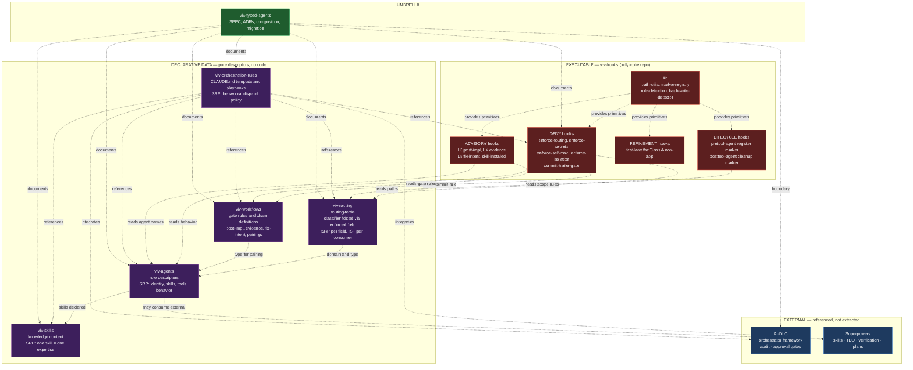
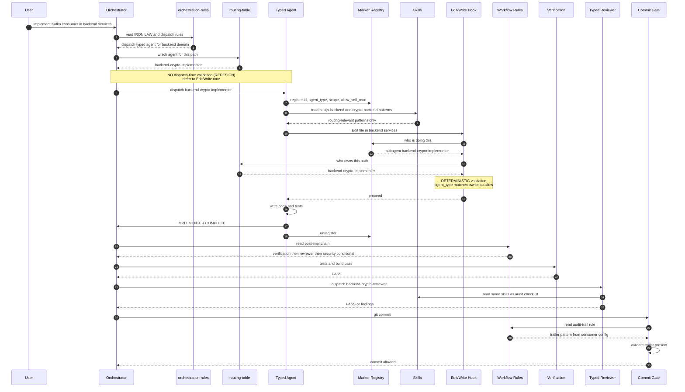
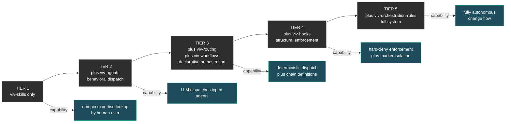

# Typed-Agents Strategy — SOLID Redesign Specification

**Version:** 0.1.0
**Status:** Draft
**Last updated:** 2026-05-08

This document specifies the redesigned typed-agents strategy. It supersedes any inherited design from viblocks-ai's `.claude/context/typed-agent-strategy.md`. Where viblocks-ai's implementation makes decisions that violate SOLID principles, this spec proposes the redesign.

---

## 1. Strategic Goals

### 1.1 Objectives (preserved from viblocks-ai)

The strategy exists to solve a concrete problem: **generic LLM dispatch produces low-quality code** because the LLM lacks domain-specific patterns at the moment of generation. The same problem exists at audit time: generic reviewers miss domain-specific issues.

**Goal 1 — Specialized dispatch:** Replace `general-purpose` dispatch with **typed agents** that carry domain knowledge embedded in their system prompts. Each typed agent is an expert in a specific stack tier (e.g. crypto-aware backend) and consumes domain-specific skills.

**Goal 2 — Quality enforcement:** Make code-quality discipline **structurally impossible to bypass** for critical paths. The main session cannot directly modify production code; only typed agents can. The post-implementation chain (verification + review + security gate) is enforced at the structural layer, not just behavioral.

**Goal 3 — Audit trail:** Every change to a critical path must carry traceable provenance (issue ID, evidence of review chain). This enforces accountability without manual ceremony.

**Goal 4 — Composability:** A consumer should be able to adopt the strategy incrementally. A small project can use just skills; a mature project can adopt the full stack including hooks and orchestration rules.

### 1.2 Architectural divergence from viblocks-ai

This spec **redesigns the architecture** rather than extracting viblocks' implementation. The redesign applies SOLID principles to every level of the system:

- **SRP at the repo level:** each component repo has one reason to change
- **OCP at the consumption level:** adding a new domain doesn't require modifying existing components
- **LSP at the agent level:** any agent of the right `type` and `domain` is substitutable for another
- **ISP at the contract level:** consumers read only the fields they need
- **DIP at the composition level:** low-level components (hooks) depend on contracts published by high-level components (agents, routing, workflows)

See `architecture/solid-audit.md` for the audit of viblocks' current implementation that justifies each redesign decision.

---

## 2. Component Architecture

### 2.1 Six components, three categories

```
DECLARATIVE DATA (pure descriptors, no executable code)
  viv-skills              knowledge content
  viv-agents              role descriptors with frontmatter contracts
  viv-routing             path-to-agent mapping with embedded enforcement classification
  viv-workflows           gate rules and chain definitions
  viv-orchestration-rules CLAUDE.md template and dispatch playbooks

EXECUTABLE CODE (single repo)
  viv-hooks               enforcement hooks consuming all of the above

UMBRELLA (this repo)
  viv-typed-agents        SPEC, ADRs, composition guides, migration plan
```

### 2.2 Static architecture



### 2.3 Per-component summary

| Component | Reason to change | Outputs (contracts exposed) | Inputs (contracts consumed) |
|---|---|---|---|
| viv-skills | Domain knowledge evolves | Skill name, pattern files, SKILL.md routing table | None |
| viv-agents | Role definition or scope changes | `name`, `type`, `domain`, `skills`, `tools`, `behavior` (frontmatter) | viv-skills (by name) |
| viv-routing | Project structure or domain registry changes | `routing-table.json` with paths, agent assignments, `enforced` flag | viv-agents (`domain`, `type`) |
| viv-workflows | Gate rules or chain composition changes | Gate rule data (post-impl, evidence schema, fix-intent, pairings) | viv-agents (`type`) |
| viv-orchestration-rules | Behavioral dispatch policy evolves | CLAUDE.md template, dispatch playbook, integration guides | All other repos by reference |
| viv-hooks | Enforcement mechanism evolves | Hook scripts (4 deny, 4 advisory, 1 refinement, 2 lifecycle), shared library | viv-routing, viv-workflows, viv-agents (read-only) |

---

## 3. Runtime Dispatch Flow

The redesigned dispatch flow eliminates two classes of fragility from viblocks' current implementation:

1. **No prompt-grep validation at Agent dispatch.** viblocks' `pretooluse-agent.sh` greps the prompt searching for paths to validate dispatch — this is heuristic and brittle. The redesign defers validation to **Edit/Write time**, where the file path is concrete and validation becomes deterministic.

2. **Dispatch metadata is explicit, not parsed.** The orchestrator reads `routing-table.json` to choose the agent. The hook reads the same `routing-table.json` to validate the choice. Both consume the same contract.



### 3.1 Dispatch lifecycle phases

| Phase | Steps | Components involved |
|---|---|---|
| **Decision** | User intent → orchestration-rules → routing lookup → agent selection | orchestration-rules, routing |
| **Side effects pre-execution** | Marker register, skill load | hooks (lifecycle), agents, skills |
| **Execution with validation** | Agent edits → hook validates against routing → write proceeds or blocks | hooks (deny), routing, marker |
| **Completion advisory** | Implementer signals complete → posttool advisory triggers chain | hooks (advisory), workflows |
| **Post-implementation chain** | Verification → reviewer → security (conditional) | workflows, agents, external (Superpowers verification) |
| **Commit gate** | Trailer validation | hooks (deny), workflows |
| **Side effects post-execution** | Marker unregister | hooks (lifecycle) |

### 3.2 Hook type taxonomy

The redesign introduces three explicit hook types (replacing viblocks' asymmetric `warn` policy):

| Type | Purpose | Honors `disabled` mode | Honors `warn` mode |
|---|---|---|---|
| **deny** | Hard block on contract violation | yes | no (would silently downgrade hard-deny) |
| **advisory** | Warn but allow; injects `additionalContext` | yes | yes |
| **refinement** | Positive override (allow what deny would block) | yes | yes |
| **lifecycle** | State management (no allow/deny decision) | no (always runs to maintain state correctness) | n/a |

This is **ADR-RD-006**.

---

## 4. SOLID Principles Applied

### 4.1 Single Responsibility (SRP)

| Concern | Owner |
|---|---|
| Domain expertise (what to do) | viv-skills |
| Role identity (who does it) | viv-agents |
| Path classification + agent assignment | viv-routing |
| Gate rules + chain composition | viv-workflows |
| Behavioral dispatch policy | viv-orchestration-rules |
| Enforcement mechanism | viv-hooks |
| Strategy specification | viv-typed-agents (this repo) |

Each component has **one reason to change**. New skill = touch viv-skills. New agent = touch viv-agents. New domain = touch viv-routing. Etc.

### 4.2 Open/Closed (OCP)

Adding a new agent does not modify existing agents. Adding a new domain to routing does not modify existing routes. Adding a new gate rule to workflows does not modify existing rules. Adding a new hook type does not modify existing hooks (they share a library through composition, not inheritance).

### 4.3 Liskov Substitution (LSP)

Any agent of the right `type` and `domain` is substitutable. Any reviewer is substitutable for another reviewer of the same domain. Any enforcement layer can be replaced as long as it consumes the same contracts (routing, workflows, agents) — including replacing `viv-hooks` entirely with a different implementation.

### 4.4 Interface Segregation (ISP)

The routing-table entries have nullable `implementer` and `reviewer` fields. A consumer that only needs path classification reads `paths` and `enforced`. A consumer that only needs reviewer pairing reads `domain` and `reviewer`. No consumer is forced to depend on fields it doesn't use.

The marker schema separates `id` (identity), `agent_type` (role), `scope` (path boundary), `allow_self_mod` (permission). Each consumer reads only what it needs.

### 4.5 Dependency Inversion (DIP)

Hooks (low-level enforcement) depend on routing/workflows/agents (high-level abstractions), not the other way around. The arrows in the static architecture diagram all flow from hooks (low) to contracts (high).

The agent declares `behavior:` in its frontmatter as a contract. The hook reads the contract. The agent has no knowledge of the hook's existence.

---

## 5. Key Redesign Decisions (ADR Index)

Each decision is documented in `architecture/decisions/`. Summary:

| ADR | Decision | Rationale |
|---|---|---|
| RD-001 | All hooks are external files; settings.json is glue only | Eliminates inline-hook anti-pattern; SRP per file |
| RD-002 | Marker registry retained as necessary tech debt; redesigned with SRP | Claude Code API doesn't expose role context; marker bridges hooks |
| RD-003 | Single `routing-table.json` with field-level SRP | Operational reality couples routing fields; SRP at field, not file |
| RD-004 | Eliminate `artifact-classifier.json`; fold into routing as `enforced` field | Single source of truth; zero invariant to maintain |
| RD-005 | Workflow gate rules as data; hooks consume the data | Separates rule definition from enforcement |
| RD-006 | Three explicit hook types: deny, advisory, refinement | Replaces asymmetric `warn` policy with typed model |
| RD-007 | Defer dispatch validation from Agent dispatch to Edit/Write time | Eliminates prompt-grep heuristic; deterministic at file_path time |
| RD-008 | Pure descriptor pattern: only `viv-hooks` contains executable code | Coherent with viv-skills/viv-agents established pattern |
| RD-009 | Preserve viblocks' objectives; redesign architecture per SOLID | This is a redesign, not an extraction |

---

## 6. Inter-Component Contracts

Each repo's README + ADRs document its contracts in detail; the per-component summary follows:

```
viv-skills exposes:
  - skill name (string, used in viv-agents `skills.required` and `skills.optional`)
  - SKILL.md with routing table (consumed by agents at runtime via Read tool)
  - patterns/ (consumed by agents and reviewers at runtime via Read tool)

viv-agents exposes:
  - frontmatter contract (name, type, domain, description, skills, tools, behavior)
  - body (system prompt, consumed at agent dispatch time)

viv-routing exposes:
  - routing-table.json schema:
    [{ domain, paths[], enforced, implementer?, reviewer?, note? }]
  - query operations (path → agent, path → enforced, agent → paths)

viv-workflows exposes:
  - post-implementation-chain.json (sequence: verification → reviewer → security)
  - evidence-schema.json (commit-comment fields required)
  - fix-intent-pattern.json (regex patterns triggering root-cause requirement)
  - implementer-reviewer-pairings.json (X-implementer ↔ X-reviewer convention)
  - audit-trail-pattern.json (commit-message trailer regex)

viv-orchestration-rules exposes:
  - CLAUDE.md template (behavioral dispatch policy as prose)
  - dispatch-playbook.md (step-by-step IRON LAW)
  - integration playbooks (AI-DLC, Superpowers, Issue-Driven flow)

viv-hooks exposes:
  - hook scripts (consumed by Claude Code via settings.json)
  - settings.json fragment (template consumer glues into theirs)
  - lib (internal, but documented for consumer awareness)
```

---

## 7. Composition Tiers

Five tiers of progressive adoption. Each tier is independent — a project can settle at T2 if T3+ is unnecessary.



Detailed in `composition/tiers.md`.

---

## 8. External Dependencies

Two external systems are referenced but **not extracted**:

### 8.1 AI-DLC

Orchestrator framework. Provides:
- Approval gates between phases (Inception, Construction, Verification, Deployment)
- Audit trail via `audit.md` and `aidlc-state.md`
- Stage-based workflow

`viv-orchestration-rules` documents how the strategy integrates with AI-DLC at each stage.

### 8.2 Superpowers

Skills + dispatch tooling plugin. Provides:
- `subagent-driven-development` (the dispatch primitive that typed agents specialize)
- `verification-before-completion` (consumed by post-implementation chain)
- `writing-plans` (consumed at code generation phase)
- `test-driven-development` (embedded in implementer IRON LAW)
- `systematic-debugging` (consumed by all implementers)
- `receiving-code-review` (consumed by implementers on re-dispatch)

`viv-orchestration-rules` documents the integration. Without Superpowers, the strategy works in degraded mode (manual TDD discipline, no `verification-before-completion` skill — consumer provides their own).

### 8.3 Boundary

The strategy **extends** AI-DLC and Superpowers; it does not replace them. A consumer can use the strategy without AI-DLC (loses approval gates and audit) or without Superpowers (loses `subagent-driven-development` integration), or with neither (degrades to T1 or T2 and behavioral-only mode).

---

## 9. Migration from viblocks-ai

Documented in `migration/from-viblocks.md`. Summary order:

1. `viv-skills` extracted (done)
2. `viv-agents` extracted (done)
3. `viv-routing` (next)
4. `viv-workflows` (after routing — depends on stable agent contracts)
5. `viv-orchestration-rules` (after workflows — references all preceding)
6. `viv-hooks` (last — depends on stable contracts from all preceding)

`viblocks-ai` migrates progressively: each component extraction is paired with viblocks-ai vendoring it back, ensuring continuous operation.

---

## 10. Outstanding Decisions

Items not resolved by this spec; deferred to per-repo ADRs.

### Resolved (2026-05-08)

- ~~**viv-workflows DSL** — JSON or YAML for gate rules~~ → JSON; consistent across schemas, rules, and examples (see [viv-workflows](https://github.com/viblocks/viv-workflows)).
- ~~**viv-orchestration-rules CLAUDE.md template structure**~~ → resolved by [viv-orchestration-rules ADR-001 (template-not-prescription)](https://github.com/viblocks/viv-orchestration-rules/blob/main/architecture/decisions/ADR-001-template-not-prescription.md) + the canonical `CLAUDE.template.md`.

### Still open

- **viv-routing schema versioning** — how to evolve the routing-table format without breaking consumers.
- **viv-hooks language** — bash + Python (status quo) vs. exploring alternatives.
- **viv-typed-agents starter kit** — should this repo contain a runnable example consumer (e.g. a bare-bones project that vendored everything correctly)? Smoke-tested via `/tmp/vendor-smoke/` (2026-05-08, 22/22 tests pass) but not yet committed as a starter kit artifact.

---

## Appendix A — Glossary

- **Agent (typed):** specialized expert role, declared in `viv-agents`. Examples: `backend-crypto-implementer`, `frontend-waas-reviewer`.
- **Class A path:** a path subject to enforcement. Determined by `enforced: true` in routing-table.
- **Dispatch:** the act of invoking a typed agent via Claude Code's Agent tool.
- **Marker:** runtime state file (`.claude/.subagent-active.json`) tracking active subagent dispatches. Used by hooks for role detection.
- **Orchestrator:** the LLM main session that reads orchestration-rules and dispatches typed agents.
- **Post-implementation chain:** the sequence of gates after an implementer completes (verification → reviewer → security → commit).
- **Skill:** packaged domain knowledge, declared in `viv-skills`. Example: `nestjs-backend`, `crypto-backend`.
- **Tier:** adoption level in the composition guide. T1 is minimum (skills only); T5 is full system.

## Appendix B — Architectural invariants (cross-cutting)

These properties hold across the system. Violation of any indicates a design regression.

1. **Skills are read by both implementer and reviewer.** Single source of truth for domain knowledge.
2. **Agents are pure descriptors.** No executable code in `viv-agents`.
3. **Routing has a single source of truth.** No duplication between routing-table and a separate classifier.
4. **Workflow rules are data, hooks are enforcers.** Rule changes happen in `viv-workflows`, not in hook code.
5. **Marker is necessary tech debt.** Documented as such; redesign efforts welcome if Claude Code API evolves.
6. **External dependencies are referenced, not extracted.** AI-DLC and Superpowers remain external.
7. **No agent name appears hardcoded outside viv-agents and routing-table.** All other consumers reference agents by lookup, not literal.
