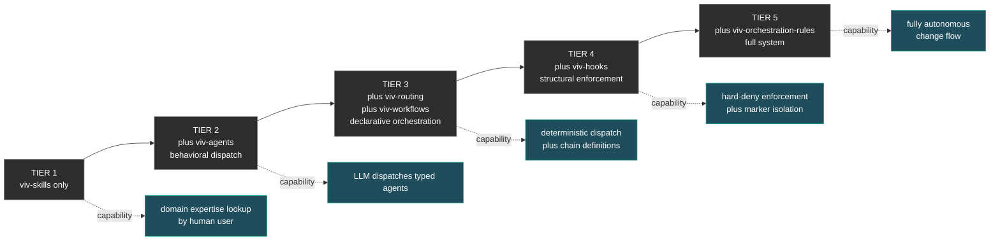

# Composition Tiers

Five progressive adoption levels. A consumer chooses the tier that matches their needs and may stop at any tier — higher tiers are additive, never required.



---

## Tier 1 — Skills only

**You vendor:** `viv-skills`

**You get:**
- Domain knowledge as packaged patterns
- Pre-PR checklists, anti-patterns, references
- Documented Critical Constraints per domain

**You provide:**
- Manual lookup ("when implementing X, read pattern Y")
- All dispatch decisions
- All review processes

**Capability:** human-driven expertise lookup. The LLM doesn't automatically dispatch — the user (or the LLM as a generalist) reads the skills and applies them.

**Best for:** small projects, prototypes, individuals who want reference material without the dispatch infrastructure.

**Example consumer setup:**
```
my-project/.claude/skills/
├── nestjs-backend/
├── crypto-backend/
└── root-cause-discipline/
```

---

## Tier 2 — Plus typed agents (behavioral dispatch)

**You add:** `viv-agents`

**You get:**
- Typed agent definitions (e.g. `backend-crypto-implementer`, `frontend-reviewer`)
- Frontmatter contracts declaring `skills`, `tools`, `behavior`
- Body system prompts with IRON LAW, Red Flags, Critical Constraints

**You provide:**
- Manual dispatch decisions (LLM picks which typed agent)
- No automatic enforcement (LLM follows the IRON LAW behaviorally)
- No structural blocks if LLM dispatches wrong agent

**Capability:** the LLM can dispatch typed agents that automatically load skills and apply patterns. Quality improves because the agent system prompt embeds discipline.

**Best for:** teams using Claude Code who want quality without setting up enforcement infrastructure.

**Example consumer setup:**
```
my-project/.claude/
├── skills/
│   └── (vendored from viv-skills)
└── agents/
    ├── backend-crypto-implementer.md
    ├── backend-crypto-reviewer.md
    ├── frontend-implementer.md
    └── ...
```

---

## Tier 3 — Plus declarative orchestration

**You add:** `viv-routing` + `viv-workflows`

**You get:**
- `routing-table.json` — explicit path → agent assignments
- Workflow rule definitions (post-impl chain, evidence schema, fix-intent pattern, audit-trail pattern, implementer↔reviewer pairings)
- Schemas to validate routing and workflow data

**You provide:**
- A glue mechanism to read these files (your own scripts or LLM behavioral rules)
- Manual enforcement (no hooks yet — rules exist but no one blocks violations)

**Capability:** dispatch decisions become **deterministic** — orchestrator looks up the agent for a path. Post-implementation chain is defined as data and can be referenced by the orchestrator.

**Best for:** projects with multiple domains where the LLM needs structured guidance, and consistency matters across team members.

**Example consumer setup:**
```
my-project/.claude/
├── skills/
├── agents/
├── routing/
│   └── routing-table.json
└── workflows/
    ├── post-implementation-chain.json
    ├── evidence-schema.json
    └── audit-trail-pattern.json
```

---

## Tier 4 — Plus structural enforcement

**You add:** `viv-hooks`

**You get:**
- 4 deny hooks (routing, secrets, self-mod, isolation)
- 4 advisory hooks (post-impl, evidence, fix-intent, skill-installed)
- 1 refinement hook (fast-lane for Class A non-app)
- 2 lifecycle hooks (marker register/cleanup)
- 1 commit-trailer-gate hook
- `lib/` with path utilities, marker registry, role detection
- `settings.json` template fragment

**You provide:**
- Glue `settings.json` that imports the template fragment (5 lines)
- Configuration of mode (`AIDLC_ENFORCEMENT_MODE` if you want disabled/warn/hard)

**Capability:** code-quality discipline is **structurally enforced**:
- Main session physically cannot edit Class A paths
- Subagents are confined to their scope
- Wrong-agent dispatches blocked at Edit/Write time
- Commits without audit trail blocked
- Issue closures without evidence blocked

**Best for:** teams that need guarantees, not just guidance. Production projects with multiple contributors and security/compliance concerns.

**Example consumer setup:**
```
my-project/.claude/
├── skills/
├── agents/
├── routing/
├── workflows/
├── hooks/
│   ├── deny/
│   ├── advisory/
│   ├── refinement/
│   ├── lifecycle/
│   └── lib/
└── settings.json   ← consumer's, imports viv-hooks template fragment
```

---

## Tier 5 — Full system (with orchestration rules)

**You add:** `viv-orchestration-rules`

**You get:**
- `CLAUDE.md` template with IRON LAW, dispatch protocol, change flow integration
- Dispatch playbook (step-by-step for the LLM)
- AI-DLC integration playbook (how typed agents bind to AI-DLC stages)
- Superpowers integration playbook (how typed agents specialize subagent-driven-development)
- Issue-Driven flow playbook (autonomous change flow)

**You provide:**
- Adapt the `CLAUDE.md` template to your project (project name, paths, conventions)

**Capability:** **fully autonomous change flow**. The LLM reads the CLAUDE.md, follows IRON LAW, dispatches typed agents per routing-table, runs post-impl chain per workflows, and respects hook enforcement automatically. Issue-Driven autonomous change flow works end-to-end.

**Best for:** mature projects integrating AI-DLC + Superpowers, with structured change flows and audit requirements. Suitable for teams operating change-as-code with high automation.

**Example consumer setup:**
```
my-project/
├── CLAUDE.md   ← from viv-orchestration-rules template, customized
└── .claude/
    ├── skills/
    ├── agents/
    ├── routing/
    ├── workflows/
    ├── hooks/
    └── settings.json
```

---

## Tier comparison summary

| Capability | T1 | T2 | T3 | T4 | T5 |
|---|---|---|---|---|---|
| Domain knowledge available | ✓ | ✓ | ✓ | ✓ | ✓ |
| LLM auto-loads skills via typed agents | | ✓ | ✓ | ✓ | ✓ |
| Deterministic dispatch lookup | | | ✓ | ✓ | ✓ |
| Workflow chains defined | | | ✓ | ✓ | ✓ |
| Hard enforcement of dispatch rules | | | | ✓ | ✓ |
| Marker-based subagent isolation | | | | ✓ | ✓ |
| Structured commit/issue gates | | | | ✓ | ✓ |
| Autonomous change flow | | | | | ✓ |
| AI-DLC/Superpowers integration documented | | | | | ✓ |

## Choosing your tier

| Project profile | Recommended tier |
|---|---|
| Solo developer using Claude Code occasionally | T1 |
| Small team using Claude Code regularly | T2 |
| Team with multiple domains (backend + frontend + infra) | T3 |
| Production project with quality/security requirements | T4 |
| Large project with structured change flows and full automation | T5 |

You can move up tiers progressively as needs evolve. Moving down (e.g. removing hooks) is equally supported — every tier is independently functional.
