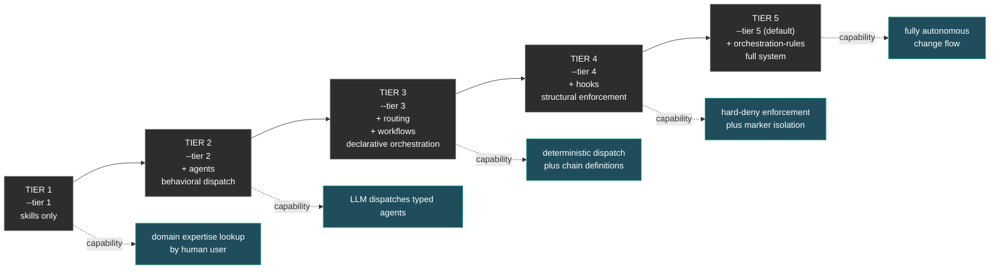

# Composition Tiers

Five progressive adoption levels of the typed-agents product. Per [ADR-RD-010](../architecture/decisions/ADR-RD-010-product-composition.md), tiers are **installer configurations** — `scripts/install.sh --tier N` deploys the right component subset to your project. They are NOT a "vendor more sub-repos" decision; the product is one installable.

A consumer chooses the tier that matches their needs and may stop at any tier — higher tiers are additive, never required. You can move up tiers later by re-running the installer with a higher `--tier` flag.



---

## Tier 1 — Skills only

```bash
./scripts/install.sh ~/your-project --tier 1
```

**You get:**
- `your-project/.claude/skills/` populated with domain knowledge content (patterns, anti-patterns, references, Critical Constraints per domain)

**Internal components deployed:** viv-skills

**You provide:**
- Manual lookup ("when implementing X, read pattern Y")
- All dispatch decisions
- All review processes

**Capability:** human-driven expertise lookup. The LLM doesn't automatically dispatch — the user (or the LLM as a generalist) reads the skills and applies them.

**Best for:** small projects, prototypes, individuals who want reference material without the dispatch infrastructure.

---

## Tier 2 — Plus typed agents (behavioral dispatch)

```bash
./scripts/install.sh ~/your-project --tier 2
```

**You get:**
- `.claude/skills/` (T1)
- `.claude/agents/` populated with typed agent definitions (frontmatter contracts + system prompts with IRON LAW, Red Flags, Critical Constraints)

**Internal components deployed:** viv-skills, viv-agents

**You provide:**
- Manual dispatch decisions (LLM picks which typed agent)
- No automatic enforcement (LLM follows the IRON LAW behaviorally)
- No structural blocks if LLM dispatches wrong agent

**Capability:** the LLM can dispatch typed agents that automatically load skills and apply patterns. Quality improves because the agent system prompt embeds discipline.

**Best for:** teams using Claude Code who want quality without setting up enforcement infrastructure.

---

## Tier 3 — Plus declarative orchestration

```bash
./scripts/install.sh ~/your-project --tier 3
```

**You get:**
- `.claude/skills/`, `.claude/agents/` (T1+T2)
- `.claude/routing/routing-table.json` — explicit path → agent assignments
- `.claude/workflows/*.json` — gate rule definitions (post-impl chain, evidence schema, fix-intent pattern, audit-trail pattern, implementer↔reviewer pairings)
- JSON Schemas for validation

**Internal components deployed:** viv-skills, viv-agents, viv-routing, viv-workflows

**You provide:**
- A glue mechanism to read these files (your own scripts, OR move to T4 to consume them via hooks)
- Manual enforcement (rules exist but no one blocks violations until T4)

**Capability:** dispatch decisions become **deterministic** — orchestrator looks up the agent for a path. Post-implementation chain is defined as data and can be referenced by the orchestrator.

**Best for:** projects with multiple domains where the LLM needs structured guidance, and consistency matters across team members.

---

## Tier 4 — Plus structural enforcement

```bash
./scripts/install.sh ~/your-project --tier 4
```

**You get:**
- All of T1+T2+T3
- `.claude/hooks/` with 4 deny + 4 advisory + 1 refinement + 2 lifecycle + 1 commit-trailer hook
- `.claude/hooks/lib/` with path utilities, marker registry, role detection, routing-loader, workflow-loader
- `.claude/hooks/settings.json.fragment` — glue snippet for your settings.json

**Internal components deployed:** viv-skills, viv-agents, viv-routing, viv-workflows, viv-hooks

**You provide:**
- Glue `settings.json` that imports the template fragment (5 lines)
- Configuration of mode (`CLAUDE_HOOKS_MODE` if you want disabled vs hard)

**Capability:** code-quality discipline is **structurally enforced**:
- Main session physically cannot edit Class A paths
- Subagents are confined to their scope
- Wrong-agent dispatches blocked at Edit/Write time
- Commits without audit trail blocked
- Issue closures without evidence blocked

**Best for:** teams that need guarantees, not just guidance. Production projects with multiple contributors and security/compliance concerns.

---

## Tier 5 — Full system (with orchestration rules)

```bash
./scripts/install.sh ~/your-project --tier 5
# (or just default — tier 5 is implicit)
./scripts/install.sh ~/your-project
```

**You get:**
- All of T1+T2+T3+T4
- `.claude/orchestration/CLAUDE.template.md` — root CLAUDE.md template with IRON LAW, dispatch protocol, change flow integration
- `.claude/orchestration/rules/dispatch-protocol.md`
- `.claude/orchestration/rules/post-implementation-chain.md`
- `.claude/orchestration/rules/ai-dlc-integration.md`
- `.claude/orchestration/rules/superpowers-integration.md`
- `.claude/orchestration/rules/issue-driven-flow.md`

**Internal components deployed:** all 6.

**You provide:**
- Adapt the `CLAUDE.template.md` to your project (copy to root, replace placeholders for project name, paths, conventions)

**Capability:** **fully autonomous change flow**. The LLM reads the CLAUDE.md, follows IRON LAW, dispatches typed agents per routing-table, runs post-impl chain per workflows, and respects hook enforcement automatically. Issue-Driven autonomous change flow works end-to-end.

**Best for:** mature projects integrating AI-DLC + Superpowers, with structured change flows and audit requirements.

---

## Tier comparison summary

| Capability | T1 | T2 | T3 | T4 | T5 |
|---|---|---|---|---|---|
| Domain knowledge available | ✓ | ✓ | ✓ | ✓ | ✓ |
| LLM auto-loads skills via typed agents | | ✓ | ✓ | ✓ | ✓ |
| Deterministic dispatch lookup | | | ✓ | ✓ | ✓ |
| Workflow chains defined | | | ✓ | ✓ | ✓ |
| Hard enforcement of dispatch rules | | | | ✓ | ✓ |
| Marker-based subagent isolation | | | | ✓ | ✓ |
| Structured commit/issue gates | | | | ✓ | ✓ |
| Autonomous change flow | | | | | ✓ |
| AI-DLC/Superpowers integration documented | | | | | ✓ |

## Choosing your tier

| Project profile | Recommended tier | Install flag |
|---|---|---|
| Solo developer using Claude Code occasionally | T1 | `--tier 1` |
| Small team using Claude Code regularly | T2 | `--tier 2` |
| Team with multiple domains (backend + frontend + infra) | T3 | `--tier 3` |
| Production project with quality/security requirements | T4 | `--tier 4` |
| Large project with structured change flows and full automation | T5 | `--tier 5` (default) |

You can move up tiers progressively — re-running the installer with a higher `--tier` adds the missing components without disturbing what's already there. Moving down is equally supported.

## Granular sub-tier selection

Beyond tier flags, the installer supports component-level and skill-level granularity (see [ADR-RD-010 §Three granularity levels](../architecture/decisions/ADR-RD-010-product-composition.md)):

```bash
# Just one skill, no agents/hooks/etc
./scripts/install.sh ~/your-project --skills crypto-backend

# Tier 4 minus orchestration playbooks
./scripts/install.sh ~/your-project --tier 4 --exclude viv-orchestration-rules

# Tier 5 but only frontend agents
./scripts/install.sh ~/your-project --tier 5 \
  --agents frontend-implementer,frontend-reviewer,frontend-crypto-implementer,frontend-crypto-reviewer
```

For surgical use without the installer, the internal sub-repos are public and `cp -r`-able:

```bash
# Cherry-pick a single skill folder
git clone https://github.com/viblocks/viv-skills /tmp/viv-skills
cp -r /tmp/viv-skills/backend/crypto-backend my-project/.claude/skills/
```

This preserves G4 (composability) — three granularity levels coexist:
1. **Whole product** via `install.sh --tier N`
2. **Component subset** via `install.sh --components X,Y --skills Z`
3. **Sub-component** via direct `cp -r` from public sub-repo
